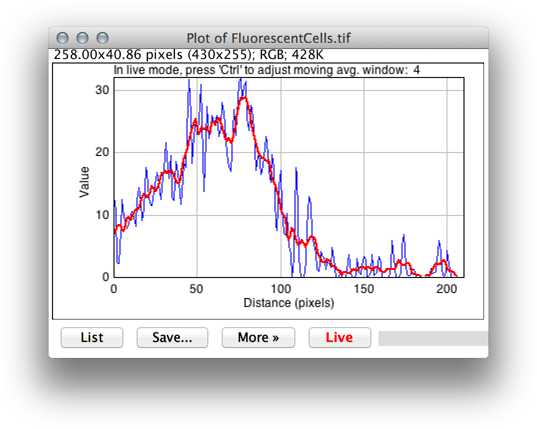

# Analysis

Scripts that complement built-in commands related to image analysis.

## LoG-DoG Spot Counter
Detects particles in a multichannel image using [TrackMate](http://imagej.net/TrackMate)'s
LoG/DoG (Laplacian/Difference of Gaussian) segmentation

## Multi ROI Profiler
Groovy script that plots ROI intensities over time. Extends ROI Manager's _Multi Plot_
command to multichannel images and ROIs of any type.

## Multichannel Plot Profile
Extends the built-in command `Analyze> Plot Profile` to multichannel (composite) images.
Features a _Live mode_, guesses displayed lookup tables and ignores disabled channels,
i.e., those deselected in the "Channels" widget (which can be called by pressing
<kbd>Z</kbd>, the shortcut for `Image> Color> Channels Tool`.

Notes:

 * Y-axis upper limit is set by the active channel. If a profile from a brighter channel
   appears truncated, turn on _Live mode_, and activate the brighter channel using the
   _C slider_ of the image.
 * By default, rectangular areas and lines wider than 1 pixel are plotted using column
   averages. To use row averages instead <kbd>Alt</kbd>. This works in _Live mode_ and
   mimics the behavior of the  built-in `Analyze> Plot Profile` command. To use column
   averages at all times, activate  the _Vertical Profile_ checkbox in
   `Edit> Options> Profile Plot Options...`
 * _Live mode_ will stop as soon as a valid ROI (straight line or rectangular selection)
   stops being present. It will resume when a new new one is reinstated.
 * If one of the channels uses an unconventional LUT, the script will plot its profile
   using black. To change the color of the plotted curves, turn on _Live mode_, activate
   the image, and apply a new LUT using the drop-down menu of the "Channels" widget.
 * By default, the X-axis will use spatially calibrated distances. To use pixel distances
   instead hold down the <kbd>Alt</kbd> key when running the plugin from the
   `BAR> Analysis>` menu.

## Multichannel ZT-axis Profile
Extends the built-in command `Image> Stack> Plot Z-axis Profile` to multichannel images,
while providing extra functionality such as Z-averaging (for 3D time sequences), choice of
statistic to be plotted and ability to trigger custom routines while in live mode.

Notes:

 * Intensities (mean, min, max or standard deviation) are retrieved from active ROI or
   entire canvas if no ROI exists
 * With timelapse hyperstacks, intensities can be averaged across Z-slices at each time
   point
 * Limits of Y-axis are automatically set to include data from all visible channels
 * Similarly to [Multichannel Plot Profile](#multichannel-plot-profile), only visible
   channels (those active in the `Image>Color>Channels Tool` widget) are plotted

## Smoothed Plot Profile
A BeanShell script that extends the built-in command `Analyze>Plot Profile` by plotting a
[simple moving average](http://en.wikipedia.org/wiki/Moving_average) of profiled data. It
inherits most features of [Multichannel Plot Profile](#multichannel-plot-profile). In
_Live mode_, and with profiled image as the frontmost window, press press <kbd>Ctrl</kbd>
to readjust the number of data points to be used in the SMA calculation.

------
| [Home] | [Analysis] | [Annotation] | [Data Analysis] | [lib] | [My Routines] | [Segmentation] | [Tools] | [Utilities] | [Wiki] |

[Home]: https://github.com/tferr/Scripts
[Analysis]: https://github.com/tferr/Scripts/tree/master/BAR/src/main/resources/scripts/BAR/Analysis
[Annotation]: https://github.com/tferr/Scripts/tree/master/BAR/src/main/resources/scripts/BAR/Annotation
[Data Analysis]: https://github.com/tferr/Scripts/tree/master/BAR/src/main/resources/scripts/BAR/Data_Analysis
[lib]: https://github.com/tferr/Scripts/tree/master/BAR/src/main/resources/lib
[My Routines]: https://github.com/tferr/Scripts/tree/master/BAR/src/main/resources/scripts/BAR/My_Routines
[Segmentation]: https://github.com/tferr/Scripts/tree/master/BAR/src/main/resources/scripts/BAR/Segmentation
[Tools]: https://github.com/tferr/Scripts/tree/master/BAR/src/main/resources/tools
[Utilities]: https://github.com/tferr/Scripts/tree/master/BAR/src/main/resources/scripts/BAR/Utilities
[Wiki]: https://imagej.net/BAR
